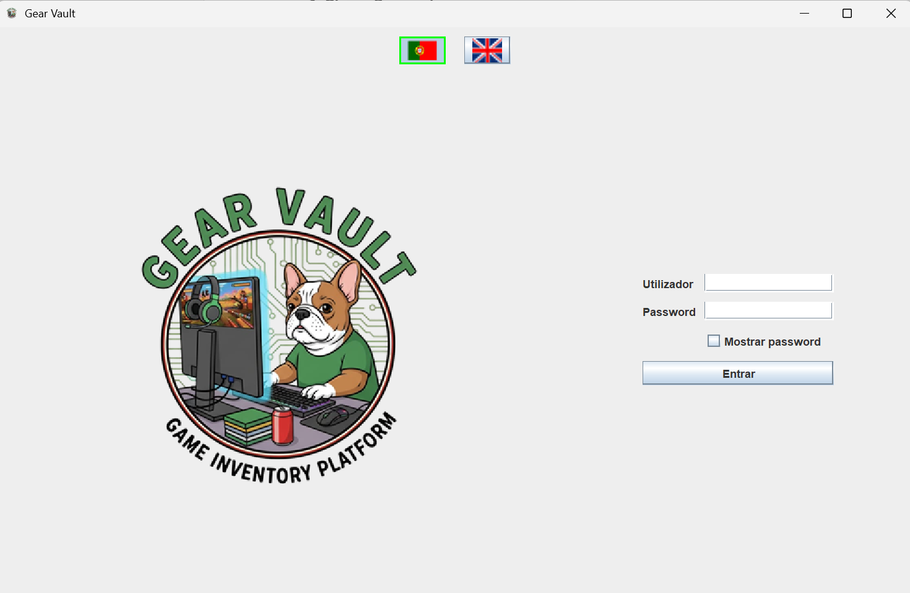
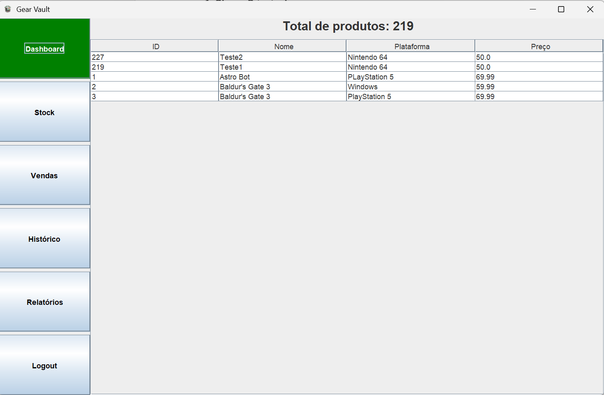
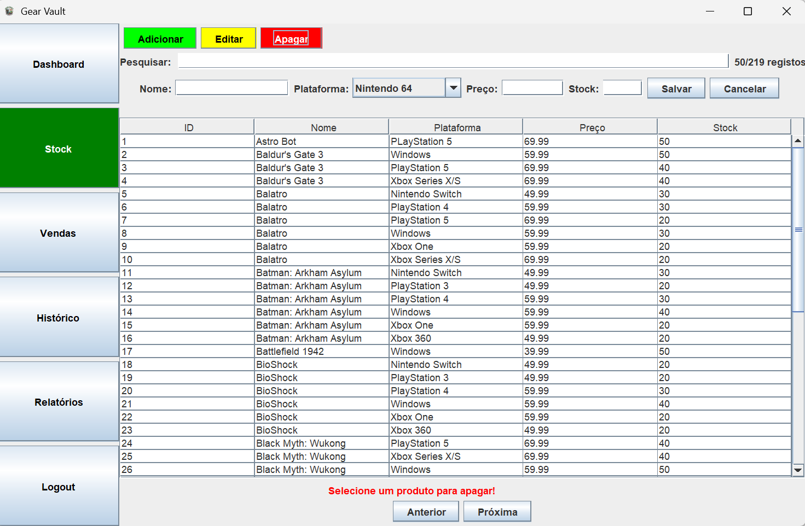
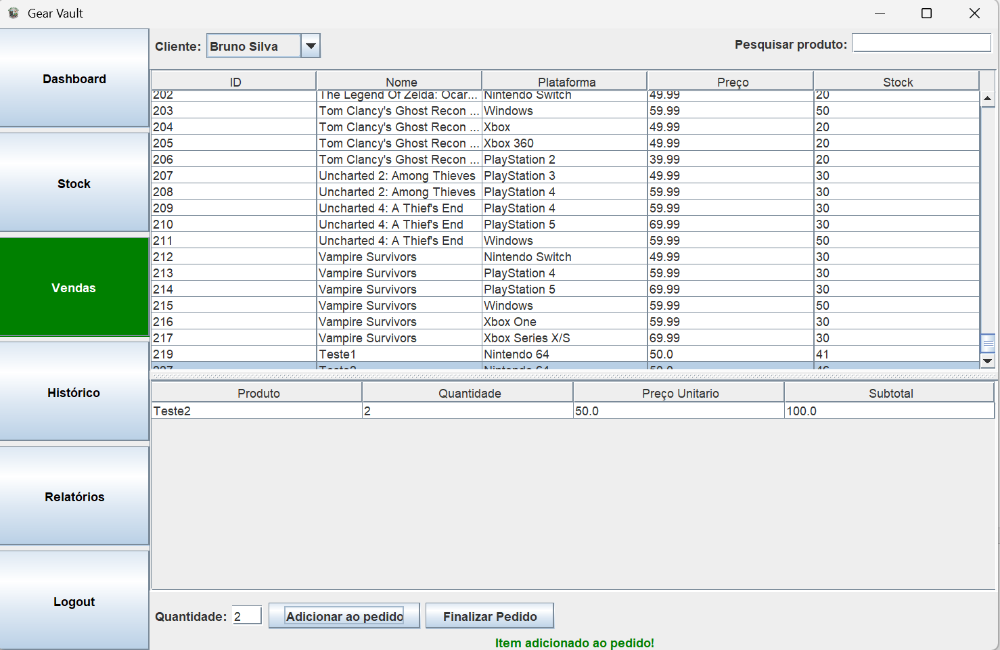
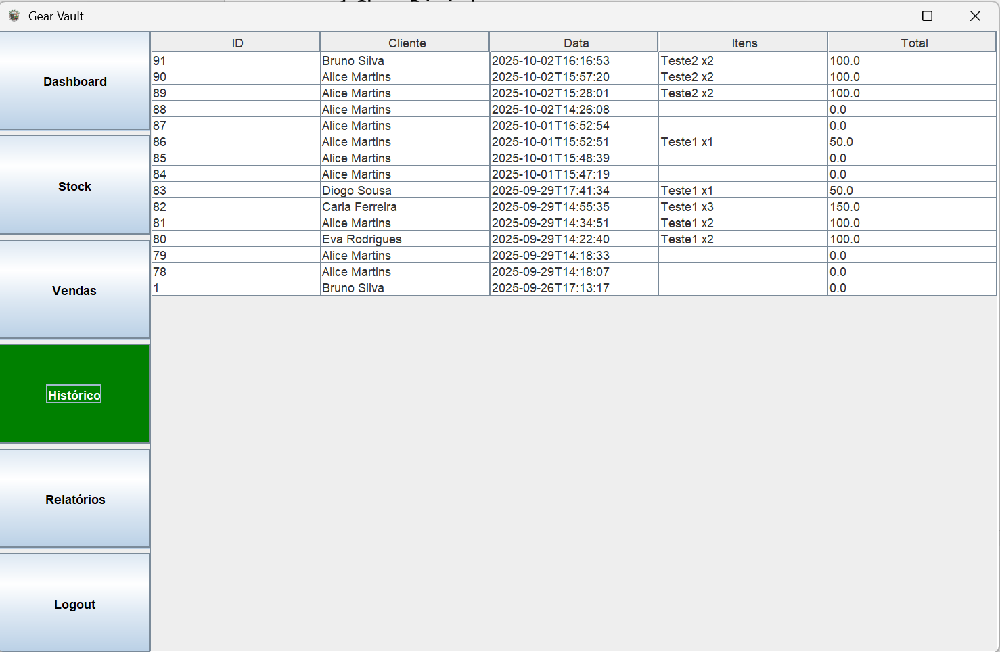
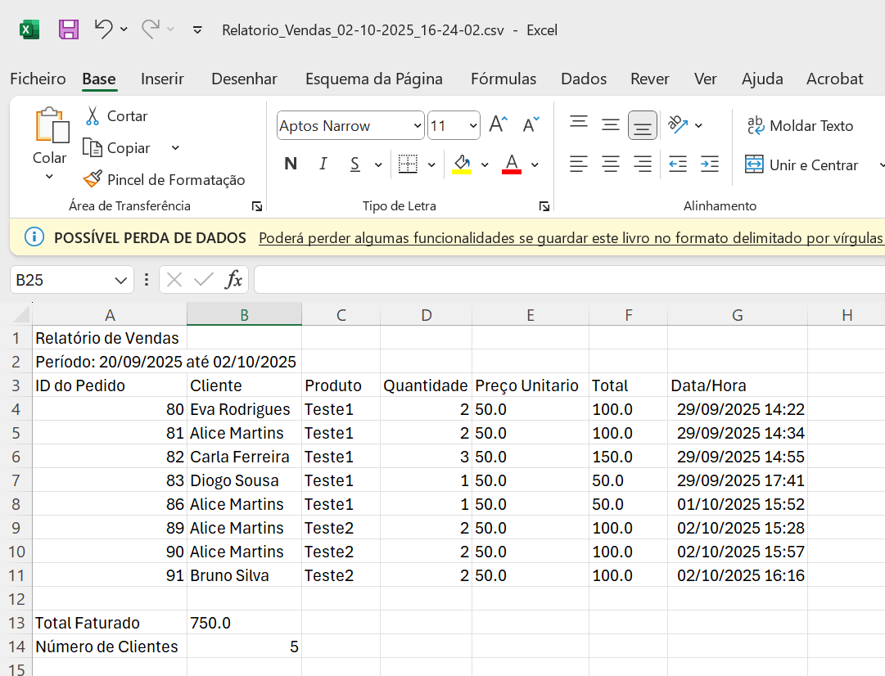
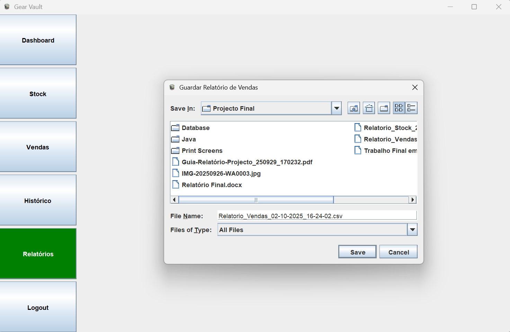
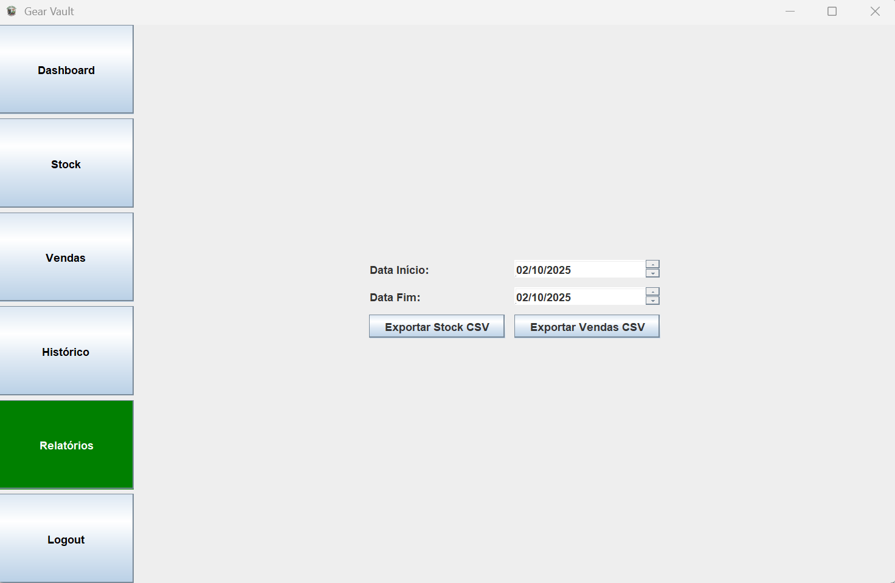

# 🎮 Gear Vault

## 🧾 Resumo

O projeto **Gear Vault** consiste no desenvolvimento de um sistema de gestão de stock orientado para lojas de venda de videojogos. 
O objetivo principal é permitir um controlo eficiente do inventário, através do registo, atualização e consulta de produtos disponíveis. 
A aplicação foi concebida para simplificar o processo de monitorização de entradas e saídas de artigos, reduzindo erros manuais e melhorando a organização do stock. 
Além disso, o sistema oferece uma geração de relatórios estatísticos.
Pode ser facilmente adaptado a outros setores de comércio.

---

## 💻 Tecnologias Utilizadas

- **JAVA**: escolhida pela sua portabilidade, orientação a objetos e vasta biblioteca de recursos. A linguagem permitiu estruturar o sistema de forma modular e escalável.  

- **SWING**: usado para criar a interface gráfica, proporcionando ao utilizador uma interação simples e intuitiva com o sistema.  

- **JTable (componente Swing)**: utilizado para apresentar os dados do inventário de forma tabular, permitindo uma visualização clara e organizada das informações dos produtos (como nome, plataforma, quantidade e preço). O componente facilita também operações como atualização e remoção de registos diretamente na interface.  

- **JDBC (Java Database Connectivity)**: adotado para realizar a ligação entre a aplicação Java e a base de dados, garantindo comunicação eficiente e segura.  

- **SQL (Structured Query Language)**: utilizado para a criação e gestão da base de dados, permitindo armazenar, consultar, atualizar e eliminar os registos de stock de videojogos.  

- **MAVEN**: utilizado para gerir o ciclo de vida do projeto, incluindo compilação, execução de testes e criação do ficheiro `.jar`. Permite organizar o código de forma padronizada (`src/main/java`, `src/main/resources`) e facilita a inclusão de futuras dependências.  

- **NETBEANS IDE**: selecionado como ambiente de desenvolvimento por oferecer uma boa integração com Java, Swing e JDBC, facilitando a implementação e a depuração do projeto.  

A escolha destas tecnologias deveu-se ao facto de proporcionarem uma solução completa: **Java** assegura a lógica e a interface, **SQL** garante a persistência dos dados e o **NetBeans** oferece um ambiente de trabalho integrado e produtivo.

---

## 📁 Estrutura do Projeto


```
Projeto/
│
├── Database/
│   └── videogames_db.sql               ← Export da base de dados MySQL
│
├── Java/
│   └── videogamesStock/
│       ├── src/main/java/com/mycompany/videogamesstock/
│       │
│       ├── VideogamesStockMain.java     ← Classe principal (inicializa a aplicação)
│       │
│       ├── 🔧 Base / Utilitários
│       │   ├── ConexaoDB.java           ← Liga-se à base de dados MySQL
│       │   ├── I18n.java                ← Internacionalização (PT/EN)
│       │   ├── PasswordUtils.java       ← Hash de passwords (SHA-256 + salt)
│       │   └── TesteConexao.java        ← Teste de ligação à BD
│       │
│       ├── 👤 Clientes
│       │   ├── Cliente.java             ← Modelo de dados do cliente
│       │   └── ClienteDAO.java          ← CRUD de clientes
│       │
│       ├── 🎮 Produtos / Stock
│       │   ├── Produto.java             ← Modelo de dados do produto
│       │   ├── ProdutoDAO.java          ← CRUD de produtos e consultas
│       │   └── ProdutoFormDialog.java   ← Formulário de criação/edição de produtos
│       │
│       ├── 🧾 Pedidos / Vendas
│       │   ├── Pedido.java              ← Cabeçalho do pedido
│       │   ├── PedidoItem.java          ← Itens do pedido
│       │   └── PedidoDAO.java           ← Gestão e gravação de pedidos
│       │
│       └── 🖥️ Interface Gráfica (GUI)
│           ├── LoginPanel.java          ← Autenticação do utilizador
│           ├── PainelPrincipal.java     ← Menu principal e navegação
│           ├── PainelVenda.java         ← Gestão das vendas/pedidos
│           ├── PainelHistorico.java     ← Histórico de pedidos
│           └── PainelRelatorio.java     ← Exportação e filtros de relatórios
│
├── resources/
│   ├── messages_pt.properties           ← Traduções (Português)
│   ├── messages_en.properties           ← Traduções (Inglês)
│   └── images/                          ← Ícones e logótipos
│       ├── Logo.png
│       ├── pt.png
│       ├── uk.png
│       └── favicon.png
│
├── config/
│   └── db.properties                    ← Configuração da ligação à base de dados
│
├── Demos/                               ← Imagens de demonstração da aplicação
│   ├── DemoDashboard.png
│   ├── DemoHomePage.png
│   ├── DemoPainelCRUDStock.png
│   ├── DemoPainelVendas.png
│   ├── DemoHistóricoVendas.png
│   ├── DemoRelatórioVendas.png
│   ├── DemoConfirmaçãoRelatório.png
│   └── DemoGerarRelatórios.png
│
└── README.md                            ← Instruções e documentação do projeto
```

---

## 🖼️ Demonstrações da Aplicação

### 🏠 Página Inicial


### 📊 Dashboard Principal


### 🧩 Gestão de Stock (CRUD)


### 💰 Painel de Vendas


### 📜 Histórico de Vendas


### 📈 Relatórios de Vendas


### ✅ Confirmação de Relatório


### 📊 Geração de Relatórios


---

## ⚙️ Requisitos Funcionais

1 - GESTÃO DE PRODUTOS (STOCK)
 • Adicionar, editar e apagar produtos (nome, plataforma, preço, stock) com confirmação do utilizador. 
 • Pesquisa e filtragem por nome ou plataforma. 

2 - DASHBOARD
 • Visualização do total de produtos e últimos 5 produtos adicionados. 
 • Atualização automática após alterações no stock.
 
3 - GESTÃO DE CLIENTES
 • Listar clientes disponíveis e selecionar cliente para venda.

4 - GESTÃO DE VENDAS
 • Adicionar itens ao pedido, validando stock e preço. 
 • Finalizar pedido: salvar no histórico, atualizar stock/dashboard e associar cliente. 
 • Pesquisa de produtos para facilitar seleção.
 
5 - HISTÓRICO DE PEDIDOS
 • Listar pedidos com detalhes (id, cliente, data, itens, total).
 • Atualização automática após cada venda. 
 
6 - RELATÓRIOS
 • Exportação de stock e vendas para CSV. 
 • Filtragem por intervalo de datas. 
 • Inclusão de resumo (total faturado, número de clientes distintos). 
 
7 - AUTENTICAÇÃO E SEGURANÇA
 • Login obrigatório, hash de passwords com SHA-256 + salt.
 • Logout encerra sessão e remove acesso aos painéis.
 
8 - INYERNACIONALIZAÇÃO (i18n)
 • Suporte a dois idiomas e atualização dinâmica durante a execução.
 
9 - USABILIDADE
 • Mensagens temporárias para erros, confirmações ou sucesso. 
 • Confirmação de saída do sistema. 
 • Navegação clara com painéis separados e botões laterais. 
 
 ---
 
## 🧠 Requisitos Não Funcionais

1 - SEGURANÇA
 • Senhas nunca em texto simples. 
 • Acesso restrito com autenticação. 
 • Confirmações em ações críticas e proteção de dados sensíveis. 
 
2 - USABILIDADE E INTERFACE
 • Interface intuitiva com navegação lateral e feedback visual (mensagens, cores de botões). 
 • Pesquisa rápida de produtos e clientes. 
 
3 - CONFIABILIDADE
 • Operações de base de dados transacionais. 
 • Tratamento de entradas inválidas e mensagens de erro claras. 
 
4 - MANUTENIBILIDADE 
 • Código modular (DAO, painéis, utilitários).
 • Internacionalização facilitada. 
 • Métodos centralizados para atualização de tabelas e interface. 
 
5 - PORTABILIDADE
 • Base de dados SQL portátil entre servidores. 
 • Aplicação desenvolvida em Java Swing, compatível com qualquer sistema com Java Runtime Environment (JRE) 8 ou superior. 
 
6 - ESCABILIDADE
 • Suporte a aumento gradual de produtos, clientes e pedidos. 
 • Tabelas com filtros eficientes para milhares de registos.

---

## 🚀 Como Executar o Projeto

### 1️⃣ Pré-requisitos

Java JDK 8 ou superior instalado no sistema.

IDE compatível com Java (NetBeans, IntelliJ IDEA, Eclipse).

MySQL Server instalado e em execução.

Permissão para criar base de dados e tabelas no MySQL.

---

### 2️⃣ Configurar a Base de Dados

Abra o MySQL Workbench ou outro cliente de MySQL.

Importe o ficheiro videogames_db.sql que se encontra na pasta Database/. Este ficheiro contém a estrutura da base de dados (tabelas, colunas, índices).

OPCIONAL: insira alguns dados de teste para produtos, users e clientes, de modo a ter acesso a todas as funcionalidades da aplicação.

Sem dados, algumas funcionalidades (login, vendas, relatórios) não estarão disponíveis.

---

### 3️⃣ Configurar a ligação à Base de Dados:

Abra o ficheiro config/db.properties na pasta Java/videogamesStock/config/.

Altere os valores para corresponder ao seu ambiente MySQL:

db.url=jdbc:mysql://localhost:3306/videogames_db
db.user=seu_usuario
db.password=sua_senha

Salve as alterações.

⚠️ Sem configurar corretamente este ficheiro, a aplicação não consegue conectar-se à base de dados.

---

### 4️⃣ Criar um User:

A aplicação exige login para aceder. Se ainda não tiver um user, insira um diretamente na tabela users da base de dados:

INSERT INTO users (username, password_hash, salt)
VALUES ('admin', '<hash_da_password>', '<salt>');

⚠️ Sem um utilizador criado, não é possível efetuar login.

---

### 5️⃣ Executar a aplicação Java:

Abra a IDE (NetBeans, Eclipse, IntelliJ).

Importe o projeto Java/videogamesStock/ como projeto Maven ou Java normal.

Compile o projeto.

Execute a classe principal VideogamesStockMain.java.

Faça login com o utilizador criado.
